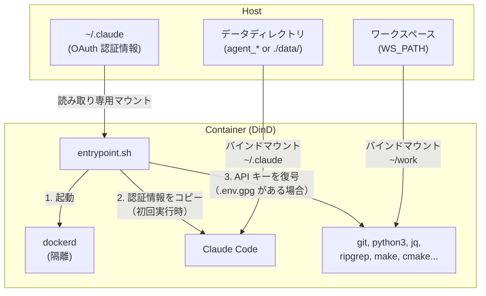
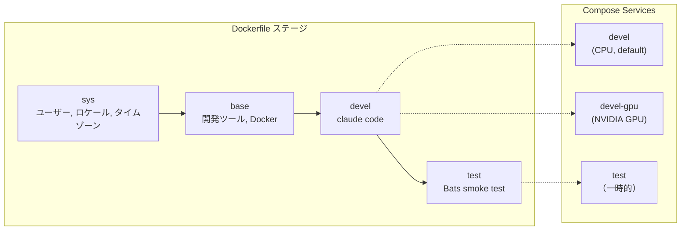
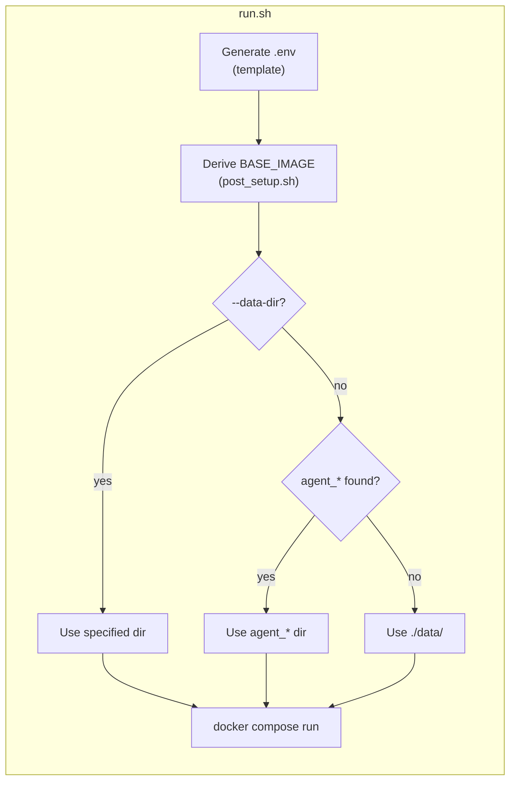

**[English](../README.md)** | **[繁體中文](README.zh-TW.md)** | **[简体中文](README.zh-CN.md)** | **日本語**

# Claude Code Docker 環境

Claude Code 用の Docker-in-Docker (DinD) 開発コンテナ。Anthropic の Claude Code CLI がプリインストールされています。CPU と NVIDIA GPU の2つのバリアントを提供し、非 root ユーザーで実行され、ホストの UID/GID を自動的にマッチングします。

## 目次

- [TL;DR](#tldr)
- [概要](#概要)
- [前提条件](#前提条件)
- [クイックスタート](#クイックスタート)
- [会話の永続化](#会話の永続化)
- [複数インスタンスの実行](#複数インスタンスの実行)
- [認証](#認証)
  - [OAuth（対話式ログイン）](#oauth対話式ログイン)
  - [API キー（暗号化）](#api-キー暗号化)
- [Subtree としての利用](#subtree-としての利用)
- [設定](#設定)
- [Smoke Tests](#smoke-tests)
- [アーキテクチャ](#アーキテクチャ)
  - [Dockerfile ステージ](#dockerfile-ステージ)
  - [Compose サービス](#compose-サービス)
  - [エントリポイントフロー](#エントリポイントフロー)
  - [プリインストール済みツール](#プリインストール済みツール)
  - [コンテナ能力](#コンテナ能力)

## TL;DR

```bash
./build.sh && ./run.sh    # Build and run (CPU, default)
```

- Claude Code がプリインストールされた隔離 Docker-in-Docker コンテナ
- 非 root ユーザー、ホストの UID/GID を自動検出
- 初回実行時に OAuth 認証情報を自動コピー、会話履歴はローカルに永続化
- 暗号化 API キー（GPG AES-256）をオプションで使用可能
- デフォルトは CPU バリアント、GPU バリアントは `./run.sh devel-gpu` を使用

## 概要







## 前提条件

- Docker（Compose V2 対応）
- GPU バリアントには [nvidia-container-toolkit](https://docs.nvidia.com/datacenter/cloud-native/container-toolkit/install-guide.html) が必要
- ホスト側で Claude Code の OAuth ログインを完了していること（`claude`）

## クイックスタート

```bash
# Build (auto-generates .env on every run)
./build.sh              # CPU variant (default)
./build.sh devel-gpu    # GPU variant
./build.sh --no-env test  # ビルドのみ、.env 更新なし

# Run
./run.sh                          # CPU variant (default)
./run.sh devel-gpu                # GPU variant
./run.sh --data-dir ../agent_foo  # Specify data directory
./run.sh --no-env -d              # バックグラウンド起動、.env 更新をスキップ

# Exec into running container
./exec.sh
```

## 会話の永続化

会話履歴とセッションデータは バインドマウント により永続化され、コンテナ再起動後も保持されます。

`run.sh` はプロジェクトディレクトリから上方向に `agent_*` ディレクトリを自動スキャンします。見つかった場合はそのディレクトリにデータを保存し、見つからない場合は `./data/` にフォールバックします。

```
# Example: if ../agent_myproject/ exists
../agent_myproject/
└── .claude/    # Claude Code conversations, settings, session

# Fallback: no agent_* directory found
./data/
└── .claude/
```

- 初回起動：OAuth 認証情報をホストからデータディレクトリにコピー
- 以降の起動：データディレクトリに既存データがあれば、そのまま使用（上書きしない）
- データディレクトリは自由にコピー、バックアップ、移動が可能
- 手動指定：`./run.sh --data-dir /path/to/dir`

## 複数インスタンスの実行

`--project-name`（`-p`）を使用して完全に隔離されたインスタンスを作成し、各インスタンスは独立した名前付き volume を持ちます：

```bash
# Instance 1
docker compose -p cc1 --env-file .env run --rm devel

# Instance 2 (in another terminal)
docker compose -p cc2 --env-file .env run --rm devel

# Instance 3
docker compose -p cc3 --env-file .env run --rm devel
```

複数インスタンスを実行する場合は、それぞれ独立した `agent_*` ディレクトリを作成してください：

```bash
mkdir ../agent_proj1 ../agent_proj2

./run.sh --data-dir ../agent_proj1
./run.sh --data-dir ../agent_proj2
```

認証情報、会話履歴、セッションデータは完全に隔離されます。クリーンアップ時は対応するディレクトリを削除するだけです：

```bash
rm -rf ../agent_proj1
```

## 認証

2つの方式をサポートしており、併用可能です。

### OAuth（対話式ログイン）

対話式 CLI 使用に適しています。まずホスト側でログインしてください：

```bash
claude   # Log in to Claude Code
```

認証情報（`~/.claude`）は読み取り専用でコンテナにマウントされ、初回起動時にデータディレクトリにコピーされます。以降の起動では既存データをそのまま使用します。

### API キー（暗号化）

プログラムによる API アクセスに適しています。キーは GPG（AES-256）で暗号化して保存され、平文では保存されません。

```bash
# 1. Create plaintext .env
cat <<EOF > .env.keys
ANTHROPIC_API_KEY=sk-ant-xxxxx
EOF

# 2. Encrypt (you will be prompted to set a passphrase)
encrypt_env.sh    # available inside container, or ./encrypt_env.sh on host

# 3. Remove plaintext
rm .env.keys
```

コンテナ起動時にワークスペースで `.env.gpg` が検出されると、パスフレーズの入力を求められます。復号されたキーは環境変数としてメモリ上にのみ保持されます。

> **注意：** `.env` と `.env.gpg` は `.gitignore` に登録されています。

## Subtree としての利用

このリポジトリは `git subtree` を使って他のプロジェクトに組み込むことができ、プロジェクト自体に Docker 開発環境を持たせることができます。

### プロジェクトへの追加

```bash
git subtree add --prefix=docker/claude_code \
    https://github.com/ycpss91255-docker/claude_code.git main --squash
```

追加後のディレクトリ構造の例：

```text
my_project/
├── src/                         # プロジェクトのソースコード
├── docker/claude_code/          # Subtree
│   ├── build.sh
│   ├── run.sh
│   ├── compose.yaml
│   ├── Dockerfile
│   └── template/
└── ...
```

### ビルドと実行

```bash
cd docker/claude_code
./build.sh && ./run.sh
```

`build.sh` は内部で `--base-path` を使用しているため、どこから実行してもパス検出が正しく動作します。

### ワークスペース検出の動作

<details>
<summary>クリックして subtree として使用時の検出動作を表示</summary>

subtree が `my_project/docker/claude_code/` にある場合：

- **IMAGE_NAME**：ディレクトリ名が `claude_code`（`docker_*` ではない）のため、検出は `.env.example` にフォールバックし、`IMAGE_NAME=claude_code` が設定されています — 正常に動作します。
- **WS_PATH**：戦略 1（同階層スキャン）と戦略 2（上方向の走査）はマッチしない可能性があるため、戦略 3（フォールバック）が親ディレクトリ（`my_project/docker/`）に解決します。

**推奨**：初回ビルド後、`.env` の `WS_PATH` を実際のワークスペースに編集してください。この値は以降のビルドで保持されます。

</details>

### 上流との同期

```bash
git subtree pull --prefix=docker/claude_code \
    https://github.com/ycpss91255-docker/claude_code.git main --squash
```

> **注意事項**：
> - ローカルの変更は git によって通常通り追跡されます。
> - 上流がローカルで変更したファイルと同じファイルを変更した場合、`subtree pull` でマージコンフリクトが発生する可能性があります。
> - subtree 内の `template/` は**変更しないでください** — env リポジトリ自体の subtree によって管理されています。

## 設定

`build.sh` / `run.sh` の実行時に `.env` が自動生成されます（`--no-env` でスキップ可能）。詳細は [.env.example](.env.example) を参照してください。

| 変数 | 説明 |
|------|------|
| `USER_NAME` / `USER_UID` / `USER_GID` | ホストに対応するコンテナユーザー（自動検出） |
| `GPU_ENABLED` | 自動検出、`BASE_IMAGE` と `GPU_VARIANT` を決定 |
| `BASE_IMAGE` | `node:20-slim`（CPU）または `nvidia/cuda:13.1.1-cudnn-devel-ubuntu24.04`（GPU） |
| `WS_PATH` | コンテナ内の `~/work` にマウントされるホストパス |
| `IMAGE_NAME` | Docker イメージ名（デフォルト：`claude_code`） |

## Smoke Tests

詳細は [TEST.md](../test/TEST.md) を参照。

## アーキテクチャ

```
.
├── Dockerfile                        # マルチステージビルド (sys -> base -> devel -> test)
├── compose.yaml                      # サービス：devel (CPU)、devel-gpu、test
├── build.sh -> template/build.sh     # ビルド、.env 自動生成（symlink）
├── run.sh -> template/run.sh         # 実行、.env 自動生成（symlink）
├── exec.sh -> template/exec.sh       # 実行中のコンテナに入る（symlink）
├── stop.sh -> template/stop.sh       # コンテナの停止と削除（symlink）
├── Makefile -> template/Makefile     # ビルドターゲット（symlink）
├── .hadolint.yaml                    # Hadolint 設定
├── encrypt_env.sh                    # API キー暗号化ヘルパー
├── post_setup.sh                     # GPU_ENABLED から BASE_IMAGE を導出
├── .env.example                      # .env テンプレート
├── .template_version                 # subtree バージョン追跡
├── script/
│   └── entrypoint.sh                 # DinD 起動、OAuth コピー、API キー復号
├── test/
│   └── smoke/
│       └── claude_env.bats           # Bats smoke test（リポジトリ固有）
├── doc/                              # 翻訳ドキュメント
│   ├── README.zh-TW.md
│   ├── README.zh-CN.md
│   └── README.ja.md
├── .github/
│   └── workflows/
│       └── main.yaml                 # CI/CD（template の reusable workflows を呼び出し）
├── template/                         # 共有スクリプトと設定（git subtree）
└── README.md
```

### Dockerfile ステージ

| ステージ | 用途 |
|----------|------|
| `sys` | ユーザー/グループ作成、ロケール、タイムゾーン、Node.js（GPU のみ） |
| `base` | 開発ツール、Python、ビルドツール、Docker、jq、ripgrep |
| `devel` | Claude Code、エントリポイント、非 root ユーザー |
| `test` | Bats smoke test（一時的、検証後に破棄） |

### Compose サービス

| サービス | 説明 |
|----------|------|
| `devel` | CPU バリアント（デフォルト） |
| `devel-gpu` | GPU バリアント、NVIDIA デバイス予約付き |
| `test` | smoke test（profile で制御） |

### エントリポイントフロー

1. sudo で `dockerd`（DinD）を起動し、準備完了まで待機（最大 30 秒）
2. OAuth 認証情報を読み取り専用マウントから `data/` ディレクトリにコピー（初回実行時のみ）
3. `.env.gpg` を復号し、API キーを環境変数としてエクスポート（存在する場合）
4. CMD（`bash`）を実行

### プリインストール済みツール

| ツール | 用途 |
|--------|------|
| Claude Code | Anthropic AI CLI |
| Docker (DinD) | コンテナ内の隔離された Docker daemon |
| Node.js 20 | CLI ツールのランタイム |
| Python 3 | スクリプト作成と開発 |
| git, curl, wget | バージョン管理とダウンロード |
| jq, ripgrep | JSON 処理とコード検索 |
| make, g++, cmake | ビルドツールチェーン |
| tree | ディレクトリ構造の可視化 |

GPU バリアントには追加で CUDA 13.1.1、cuDNN、OpenCL、Vulkan が含まれます。

### コンテナ能力

両サービスとも DinD の正常動作のために `SYS_ADMIN`、`NET_ADMIN`、`MKNOD` 能力と `seccomp:unconfined` が必要です。内部 Docker daemon はホストから完全に隔離されています。
