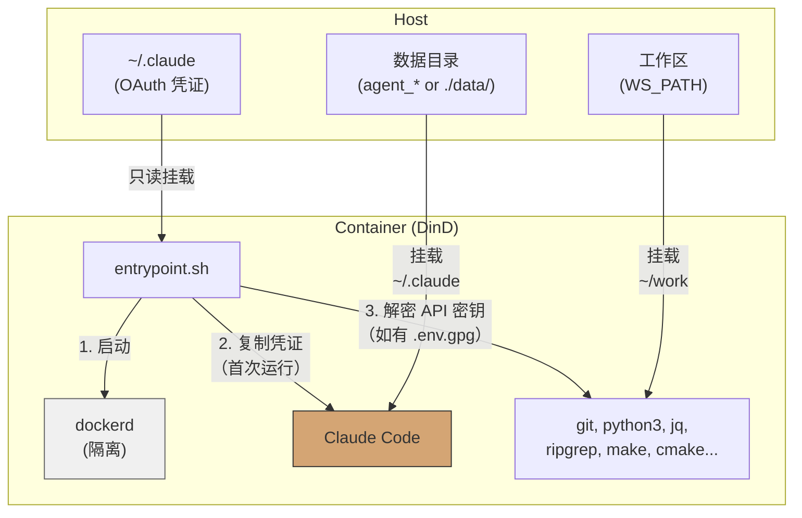
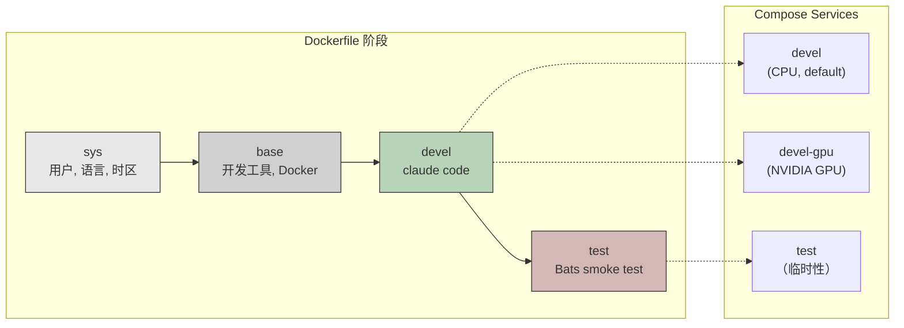
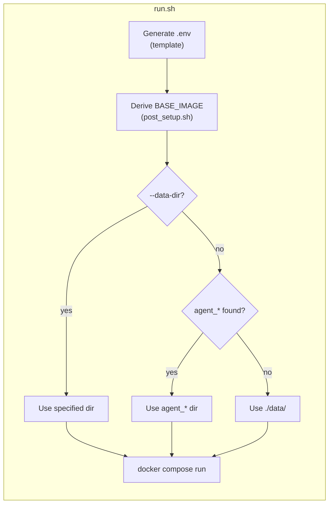

**[English](../README.md)** | **[繁體中文](README.zh-TW.md)** | **简体中文** | **[日本語](README.ja.md)**

# Claude Code Docker 环境

Claude Code 的 Docker-in-Docker (DinD) 开发容器，预先安装 Anthropic 的 Claude Code CLI。提供 CPU 与 NVIDIA GPU 两种版本，以非 root 用户执行并自动对应主机的 UID/GID。

## 目录

- [TL;DR](#tldr)
- [概述](#概述)
- [前置需求](#前置需求)
- [快速开始](#快速开始)
- [对话持久化](#对话持久化)
- [执行多个实例](#执行多个实例)
- [身份验证](#身份验证)
  - [OAuth（交互式登录）](#oauth交互式登录)
  - [API 密钥（加密）](#api-密钥加密)
- [作为 Subtree 使用](#作为-subtree-使用)
- [设置](#设置)
- [smoke test](#smoke test)
- [架构](#架构)
  - [Dockerfile 阶段](#dockerfile-阶段)
  - [Compose 服务](#compose-服务)
  - [入口点流程](#入口点流程)
  - [预安装工具](#预安装工具)
  - [容器能力](#容器能力)

## TL;DR

```bash
./build.sh && ./run.sh    # Build and run (CPU, default)
```

- 隔离的 Docker-in-Docker 容器，预先安装 Claude Code
- 非 root 用户，自动检测主机 UID/GID
- 首次执行时自动复制 OAuth 凭证，对话记录持久化存储于本机
- 可选加密 API 密钥（GPG AES-256）
- 默认 CPU 版本，GPU 版本使用 `./run.sh devel-gpu`

## 概述







## 前置需求

- Docker with Compose V2
- GPU 版本需要 [nvidia-container-toolkit](https://docs.nvidia.com/datacenter/cloud-native/container-toolkit/install-guide.html)
- 在主机上完成 Claude Code 的 OAuth 登录（`claude`）

## 快速开始

```bash
# Build (auto-generates .env on every run)
./build.sh              # CPU variant (default)
./build.sh devel-gpu    # GPU variant
./build.sh --no-env test  # 构建但不更新 .env

# Run
./run.sh                          # CPU variant (default)
./run.sh devel-gpu                # GPU variant
./run.sh --data-dir ../agent_foo  # Specify data directory
./run.sh --no-env -d              # 后台启动，跳过 .env 更新

# Exec into running container
./exec.sh
```

## 对话持久化

对话记录与工作会话数据通过 挂载 持久化存储，容器重启后仍可保留。

`run.sh` 会自动从项目目录向上扫描 `agent_*` 目录。若找到，数据将存储于该目录；否则回退使用 `./data/`。

```
# Example: if ../agent_myproject/ exists
../agent_myproject/
└── .claude/    # Claude Code conversations, settings, session

# Fallback: no agent_* directory found
./data/
└── .claude/
```

- 首次启动：OAuth 凭证从主机复制至数据目录
- 后续启动：数据目录已有数据，直接使用（不覆写）
- 可自由复制、备份或移动数据目录
- 手动指定路径：`./run.sh --data-dir /path/to/dir`

## 执行多个实例

使用 `--project-name`（`-p`）创建完全隔离的实例，每个实例拥有独立的具名 volume：

```bash
# Instance 1
docker compose -p cc1 --env-file .env run --rm devel

# Instance 2 (in another terminal)
docker compose -p cc2 --env-file .env run --rm devel

# Instance 3
docker compose -p cc3 --env-file .env run --rm devel
```

若需执行多个实例，请分别创建独立的 `agent_*` 目录：

```bash
mkdir ../agent_proj1 ../agent_proj2

./run.sh --data-dir ../agent_proj1
./run.sh --data-dir ../agent_proj2
```

凭证、对话记录与工作会话数据皆完全隔离。清除时，直接删除对应目录即可：

```bash
rm -rf ../agent_proj1
```

## 身份验证

支持两种方式，可同时使用。

### OAuth（交互式登录）

适用于交互式 CLI 使用。请先在主机上登录：

```bash
claude   # Log in to Claude Code
```

凭证（`~/.claude`）以只读方式挂载至容器内，并于首次启动时复制至数据目录。后续启动将直接使用现有数据。

### API 密钥（加密）

适用于程序化的 API 访问。密钥以 GPG（AES-256）加密存储，不以明文保存。

```bash
# 1. Create plaintext .env
cat <<EOF > .env.keys
ANTHROPIC_API_KEY=sk-ant-xxxxx
EOF

# 2. Encrypt (you will be prompted to set a passphrase)
encrypt_env.sh    # available inside container, or ./encrypt_env.sh on host

# 3. Remove plaintext
rm .env.keys
```

容器启动时，若检测到工作区中有 `.env.gpg`，将提示输入口令。解密后的密钥仅以环境变量形式保存于内存中。

> **注意：** `.env` 与 `.env.gpg` 已加入 `.gitignore`。

## 作为 Subtree 使用

此 repo 可通过 `git subtree` 嵌入至其他项目，让项目自带 Docker 开发环境。

### 添加到你的项目

```bash
git subtree add --prefix=docker/claude_code \
    https://github.com/ycpss91255-docker/claude_code.git main --squash
```

添加后的目录结构示例：

```text
my_project/
├── src/                         # 项目源代码
├── docker/claude_code/          # Subtree
│   ├── build.sh
│   ├── run.sh
│   ├── compose.yaml
│   ├── Dockerfile
│   └── template/
└── ...
```

### 构建与运行

```bash
cd docker/claude_code
./build.sh && ./run.sh
```

`build.sh` 内部使用 `--base-path`，因此无论从何处执行，路径检测都能正确工作。

### 工作区检测行为

<details>
<summary>展开查看作为 subtree 使用时的检测行为</summary>

当 subtree 位于 `my_project/docker/claude_code/` 时：

- **IMAGE_NAME**：目录名称为 `claude_code`（非 `docker_*`），因此检测会回退至 `.env.example`，其中设置了 `IMAGE_NAME=claude_code` — 可正常工作。
- **WS_PATH**：策略 1（同层扫描）与策略 2（向上遍历）可能无法匹配，因此策略 3（回退）会解析至上层目录（`my_project/docker/`）。

**建议**：首次构建后，请编辑 `.env` 中的 `WS_PATH` 指向实际工作区。此值在后续构建中会被保留。

</details>

### 同步上游更新

```bash
git subtree pull --prefix=docker/claude_code \
    https://github.com/ycpss91255-docker/claude_code.git main --squash
```

> **注意事项**：
> - 本地修改会由 git 正常跟踪。
> - 若上游修改了与你本地相同的文件，`subtree pull` 可能会产生合并冲突。
> - **不要**修改 subtree 内的 `template/` — 它由 env repo 自身的 subtree 管理。

## 设置

每次执行 `build.sh` / `run.sh` 时会自动生成 `.env`（可传入 `--no-env` 跳过）。详情请参阅 [.env.example](.env.example)。

| 变量 | 说明 |
|------|------|
| `USER_NAME` / `USER_UID` / `USER_GID` | 对应主机的容器用户（自动检测） |
| `GPU_ENABLED` | 自动检测，决定 `BASE_IMAGE` 与 `GPU_VARIANT` |
| `BASE_IMAGE` | `node:20-slim`（CPU）或 `nvidia/cuda:13.1.1-cudnn-devel-ubuntu24.04`（GPU） |
| `WS_PATH` | 主机路径，挂载至容器内的 `~/work` |
| `IMAGE_NAME` | Docker 镜像名称（默认：`claude_code`） |

## smoke test

构建 test target 验证环境：

```bash
./build.sh test
```

位于 `test/smoke/claude_env.bats`，共 **29** 项。

<details>
<summary>展开查看测试详情</summary>

#### AI 工具 (3)

| 测试项目 | 说明 |
|----------|------|
| `claude` | 可用 |
| `gemini` | 可用 |
| `codex` | 可用 |

#### 开发工具 (14)

| 测试项目 | 说明 |
|----------|------|
| `node` | 可用 |
| `npm` | 可用 |
| `git` | 可用 |
| `python3` | 可用 |
| `make` | 可用 |
| `cmake` | 可用 |
| `g++` | 可用 |
| `curl` | 可用 |
| `wget` | 可用 |
| `jq` | 可用 |
| `rg` (ripgrep) | 可用 |
| `tree` | 可用 |
| `docker` | 可用 |
| `gpg` | 可用 |

#### 系统 (7)

| 测试项目 | 说明 |
|----------|------|
| 用户 | 非 root |
| `sudo` | 免密码执行 |
| 时区 | `Asia/Taipei` |
| `LANG` | `en_US.UTF-8` |
| work 目录 | 存在 |
| work 目录 | 可写入 |
| `entrypoint.sh` | 存在 |

#### 排除工具 (4)

| 测试项目 | 说明 |
|----------|------|
| `tmux` | 未安装（最小化镜像） |
| `vim` | 未安装 |
| `fzf` | 未安装 |
| `terminator` | 未安装 |

#### 安全性 (1)

| 测试项目 | 说明 |
|----------|------|
| `encrypt_env.sh` | 在 PATH 中 |

</details>

## 架构

```
.
├── Dockerfile                        # 多阶段构建 (sys -> base -> devel -> test)
├── compose.yaml                      # 服务：devel (CPU)、devel-gpu、test
├── build.sh -> template/build.sh     # 构建并自动生成 .env（symlink）
├── run.sh -> template/run.sh         # 运行并自动生成 .env（symlink）
├── exec.sh -> template/exec.sh       # 进入运行中的容器（symlink）
├── stop.sh -> template/stop.sh       # 停止并移除容器（symlink）
├── Makefile -> template/Makefile     # 构建目标（symlink）
├── .hadolint.yaml                    # Hadolint 配置
├── encrypt_env.sh                    # API 密钥加密工具
├── post_setup.sh                     # 根据 GPU_ENABLED 决定 BASE_IMAGE
├── .env.example                      # .env 模板
├── .template_version                 # subtree 版本跟踪
├── script/
│   └── entrypoint.sh                 # DinD 启动、OAuth 复制、API 密钥解密
├── test/
│   └── smoke/
│       └── claude_env.bats           # Bats smoke test（repo 专属）
├── doc/                              # 翻译文档
│   ├── README.zh-TW.md
│   ├── README.zh-CN.md
│   └── README.ja.md
├── .github/
│   └── workflows/
│       └── main.yaml                 # CI/CD（调用 template 的 reusable workflows）
├── template/                         # 共享脚本与配置（git subtree）
└── README.md
```

### Dockerfile 阶段

| 阶段 | 用途 |
|------|------|
| `sys` | 用户/群组创建、语言环境、时区、Node.js（仅 GPU） |
| `base` | 开发工具、Python、构建工具、Docker、jq、ripgrep |
| `devel` | Claude Code、入口点、非 root 用户 |
| `test` | Bats smoke test（临时性，验证后丢弃） |

### Compose 服务

| 服务 | 说明 |
|------|------|
| `devel` | CPU 版本（默认） |
| `devel-gpu` | GPU 版本，具备 NVIDIA 设备保留 |
| `test` | smoke test（profile 限定） |

### 入口点流程

1. 通过 sudo 启动 `dockerd`（DinD），等待就绪（最多 30 秒）
2. 将 OAuth 凭证从只读挂载点复制至 `data/` 目录（仅首次执行）
3. 解密 `.env.gpg` 并将 API 密钥导出为环境变量（若存在）
4. 执行 CMD（`bash`）

### 预安装工具

| 工具 | 用途 |
|------|------|
| Claude Code | Anthropic AI CLI |
| Docker (DinD) | 容器内的隔离 Docker daemon |
| Node.js 20 | CLI 工具的执行环境 |
| Python 3 | 脚本编写与开发 |
| git, curl, wget | 版本控制与下载 |
| jq, ripgrep | JSON 处理与代码搜索 |
| make, g++, cmake | 构建工具链 |
| tree | 目录结构可视化 |

GPU 版本额外包含：CUDA 13.1.1、cuDNN、OpenCL、Vulkan。

### 容器能力

两种服务皆需要 `SYS_ADMIN`、`NET_ADMIN`、`MKNOD` 能力以及 `seccomp:unconfined`，以确保 DinD 正常运作。内部 Docker daemon 与主机完全隔离。
